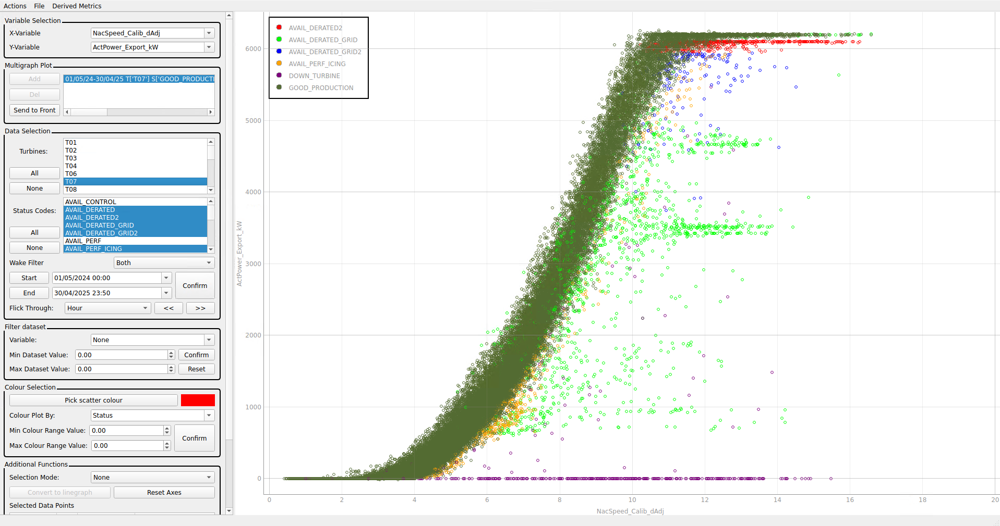
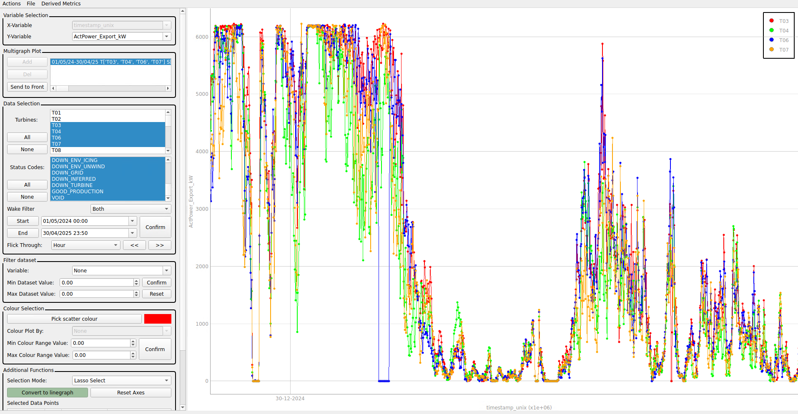
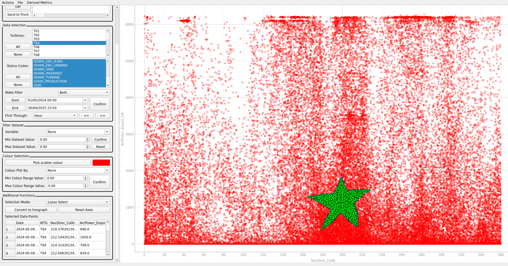
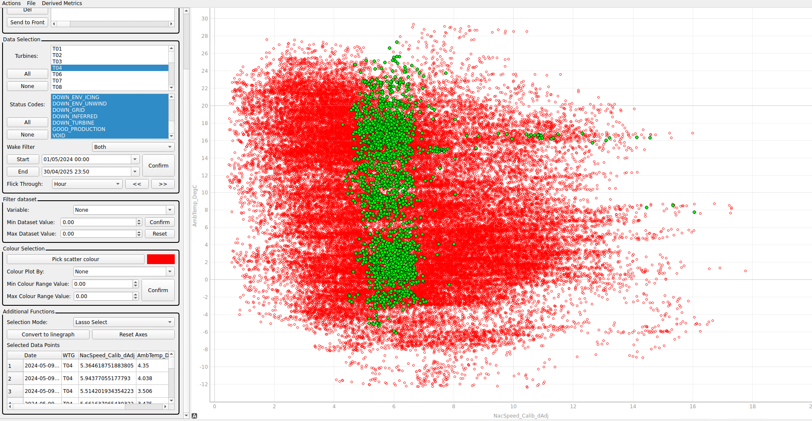

# K2-Management-Internship-Project

> Python desktop application developed during a Software Engineering Internship at K2 Management.

## Project Overview

During my internship at K2 Management, I independently developed a Python-based desktop application for visualising and analysing wind turbine operational data.

The application was created as a modern replacement for a legacy C# tool that had been used internally since 2012. The project required balancing performance, usability, and maintainability while supporting increasingly large wind turbine datasets.

My objective was to design and implement a modern, scalable solution that could handle larger datasets, provide a better user experience, and serve as a maintainable foundation for future development.

> Note: This repository serves as a portfolio showcase only. The source code belongs to K2 Management. 

## My Responsibilities
My responsibilities included:

- Designing the application architecture
- Developing the PyQt user interface
- Implementing data processing functionality using Pandas
- Building interactive visualisation tools using PyQtGraph
- Optimising performance for large datasets
- Testing and validating functionality against the legacy C# application
- Delivering the final production-ready application to stakeholders

## Results

The completed application delivered measurable improvements over the legacy system:
- Approximately 10% faster execution
- Support for datasets over 4× larger than the previous application
- Improved maintainability through a modular Python codebase
- New visualisation capabilities not available in the original software

## Technologies Used

| Technology | Purpose |
| ---------- | -------- |
| Python3    | Core application development of the backend and database |
| PyQt       | Desktop GUI development |
| PyQtGraph  | High performance, dynamic data visualisation |
| Pandas     | Efficient processing and manipulation of large datasets |

## Key Features
Some of the key features of the desktop application were:

### Interactive Data Visualisation
Users could quickly explore large wind turbine datasets through an interactive plot. Users had access to a host of useful features:
- Change X and Y axis variables.
- Plot multiple Data Sets on the same axes
- Filter the plotted points for each dataset
- Colour the dataset using a third variable
- Convert to a linegraph
- Use multiple selection options to select points from the dataset.

> An example screenshot of the application, illustrating all the features on the left, and an example plot of Wind Speed vs Power Generated, coloured by the category assigned to each datapoint.

### Intelligent User Interface
The application was designed with usability as a primary focus. Features included:
- Context-aware button activation
- Dynamic highlighting of active tools
- Automatic legend placement
- Streamlined dataset selection workflows
- Select All / Select None functionality

> A Screenshot of the application in Lineplot Mode. Some of the Smart UI features are on display too.

### Advanced Data Selection Tool
One feature I implemented allowed users to select groups of data points directly from a graph.

Selected points could then be transferred between different visualisations while preserving the selection.

This required maintaining the relationship between visualised data and the underlying dataset as users changed graph configurations.

> Some selected points on a set of axes.

> The same set of selected points on a different set of axes. 

## What I Learned

### Object-Oriented Software Design
Developing the application from scratch reinforced the value of object-oriented programming for building scalable and maintainable software. Separating GUI, data processing, and visualisation logic into independent components made the application easier to extend and debug.

### Efficient Data Processing with Pandas
Working with large wind turbine datasets taught me how to leverage Pandas for efficient data loading, filtering, and manipulation. I gained experience optimising data workflows to maintain application responsiveness when handling datasets exceeding 1 GB.

### GUI Development with PyQt
I learned how to design desktop applications with usability as a primary consideration. This included creating intuitive workflows, providing visual feedback to users, and implementing context-aware controls that guide user interactions.

### Data Visualisation Principles
Building engineering visualisation tools gave me a greater appreciation for effective data presentation. I learned how choices such as colour usage, graph design, and visual hierarchy can significantly impact how easily users interpret data.

### Desktop Application Architecture
Designing a complete desktop application independently provided experience in structuring larger software projects, managing dependencies between components, and balancing maintainability with feature development.

### Python Development Environments
I gained experience working with Python virtual environments and dependency management, helping ensure reproducible development setups and reducing conflicts between project requirements.
